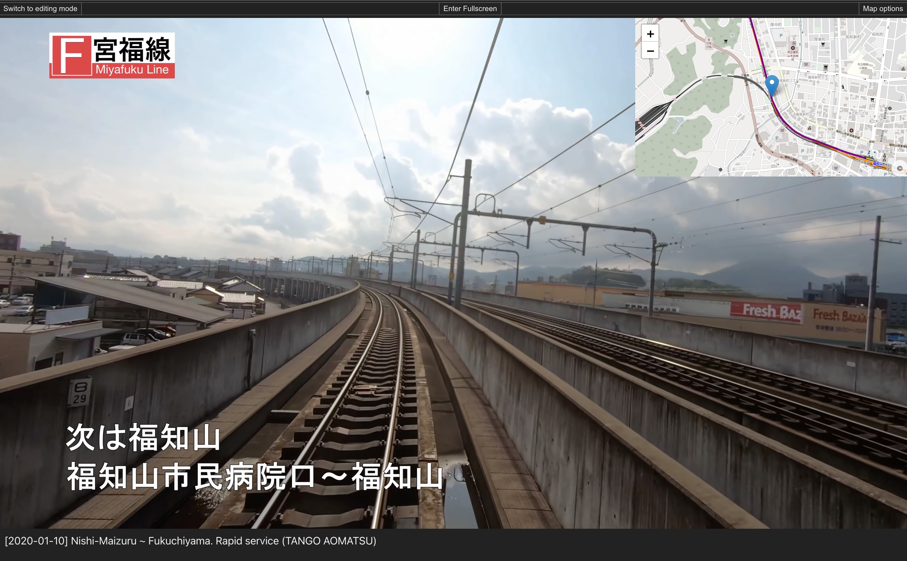

# Train Ride Maps - Synchronized map view for train videos

With this webapp, you can watch train videos with an overlaid map of the train's location.

[Try the webapp now](https://train-ride-maps.lehnerpat.com/)

There are some videos with route data available in the webapp, just choose one of the "example tracks" on the start page!

Screenshot:

## How it works

The webapp embeds a YouTube video, and overlays an OpenStreetMap map view over it. If there is timing & location data for the video, the map shows the train's location synchronized with video playback.

Note that timing & location data must be entered manually with this webapp; this data is not extracted automatically from the video.

## Documentation

- [User guide](doc/user-guide.md): start page, viewing and editing mode, shortcuts
- [Importing paths from OpenStreetMap](doc/osm-import.md)
- [Concepts & data model](doc/concepts.md): tracks, timing points, persistence
- [Known limitations, ideas & development notes](doc/known-issues-and-ideas.md)

## Development

Use Node.js 24 and Yarn 1. Run `yarn install` to install dependencies, `yarn start` to start the Vite development server, `yarn test --run` to run tests, `yarn typecheck` to check TypeScript, and `yarn build` to create the production build in `build/`.

---

## License

The source code in this repository is published under the MIT license. You can find the full license text in the [LICENSE file](LICENSE).
