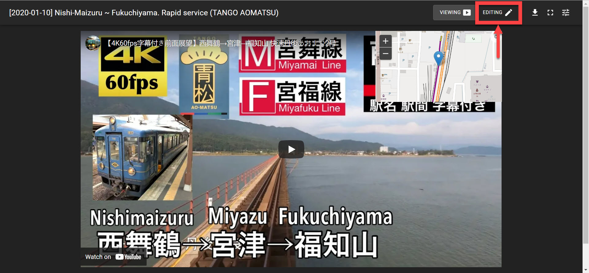
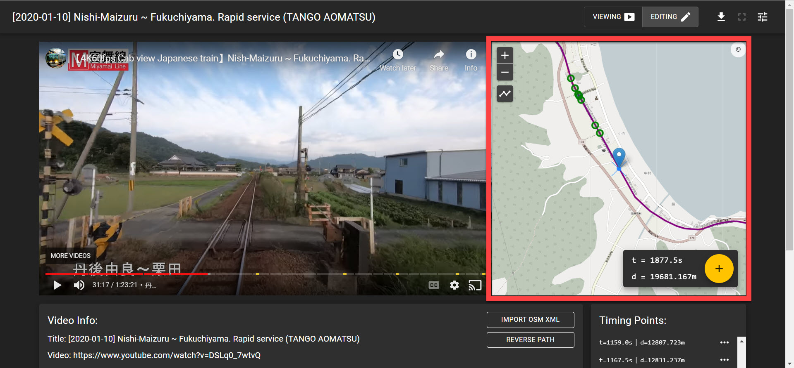
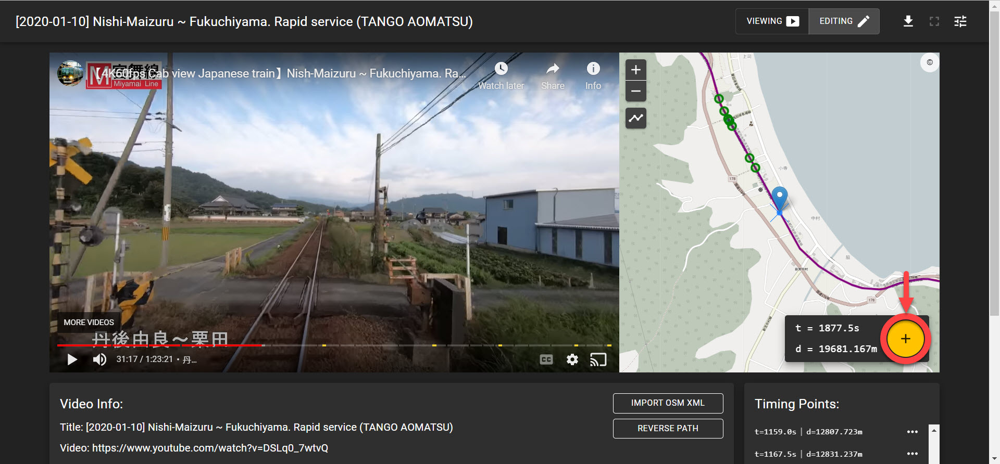
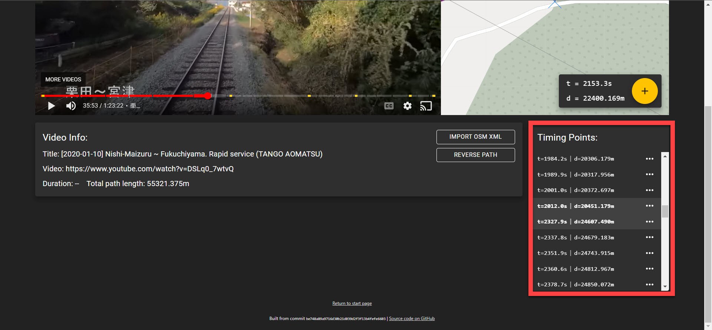
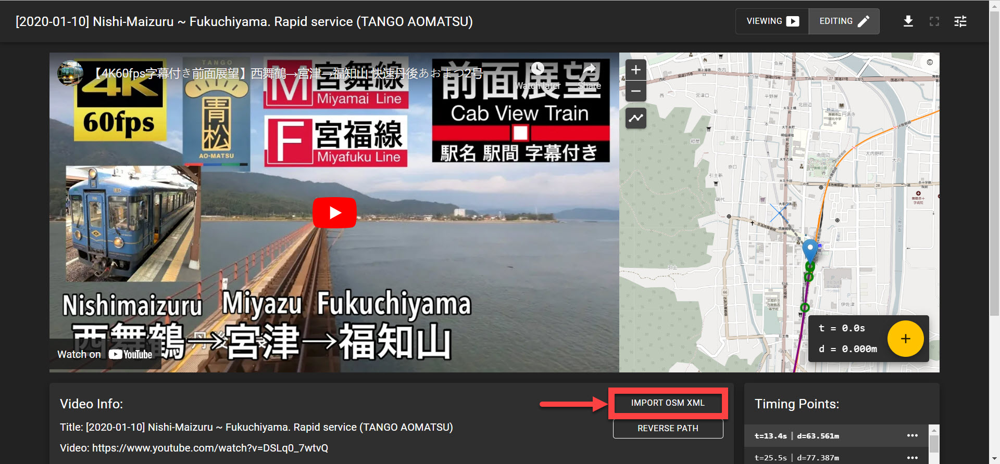
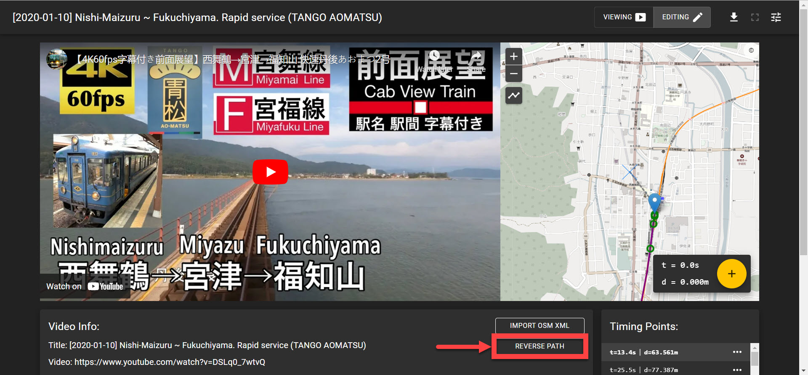

# User guide

See also [concepts.md](concepts.md) for the underlying data model.

The current page is stored in the URL fragment (for example, `/#/track/<id>`), so track links and bookmarks work on static hosting. Tracks saved only in browser storage remain available only in that browser.

## Start page

- **Example tracks**: bundled tracks. Opening one in a browser that has a locally-edited copy opens the local copy (see [persistence](concepts.md#persistence)).
- **Tracks saved in browser**: all tracks in `localStorage`; the trash icon deletes a track permanently (there is no confirmation).
- **Upload file…**: loads a track JSON file (as produced by the download button) and saves it to the browser.
- **Create new track**: needs a title and a video URL starting with `https://` (YouTube). The new track has an empty path, so you must import a path (see [osm-import.md](osm-import.md)) in editing mode before you can add timing points.

## Viewing mode

Shows the video with the map as an overlay and the train's current position as a marker. The top bar has:

<!-- prettier-ignore -->
| Control                  | Function                              |
| ------------------------ | ------------------------------------- |
| Viewing / Editing toggle | Switch modes                          |
| Download                 | Save the track as `track_<uuid>.json` |
| Fullscreen               | Fullscreens video + map together (disabled in editing mode; the YouTube player's own fullscreen is disabled on purpose). Not available on iPhone Safari, which lacks the Fullscreen API |
| View options             | See below                             |

### Keyboard shortcuts

Only these app-level shortcuts exist (handled on `keypress` of the page body, so they may not fire while an element such as the video iframe has focus):

| Key       | Action                               |
| --------- | ------------------------------------ |
| `f`       | Enter fullscreen (viewing mode only) |
| `Shift+E` | Toggle editing mode                  |

The YouTube player and Leaflet map have their own built-in shortcuts while focused (e.g. space/arrows for the player; `+`/`-` and arrow keys for the map). There is no way yet to control the player while the map has focus ([#10][issue-10]).

### View options

- Auto-pan map to current position
- Show track path
- Editing mode: crosshair overlay for map centre, timing point markers on the path
- Timing points list: auto-scroll to the current timing point
- **Straight rail overlay**: draws two adjustable lines over the video to help judge whether the train is on a straight section. "Edit overlay" lets you drag the line endpoints and set colour, opacity and width.

## Editing mode

This mode allows users to add and remove timing points to refine the syncing of map and video. Click the **EDITING** button in the upper-right corner of the screen to open it (or press `Shift+E`). The video is shown beside a large map, plus a "Video Info" panel and the timing points list.

### Timing points map

The **timing points map** appears on the right side of the editing mode screen. It displays the track path and train position.

- The position of the train as referenced in the video is indicated by the **blue pin**.
- The track path (as imported or edited) appears as a **purple line**.
- Timing points are indicated by **green circles**.
- A blue dot with a dashed grey line shows where the map centre projects onto the path.

#### Changing the map view

- Zoom in and out with:
  - the buttons in the upper-left corner of the map,
  - the mouse wheel,
  - the `-` and `+` keys (Leaflet default, while the map has focus).
- While the video is paused, pan with:
  - mouse click and drag,
  - the arrow keys (Leaflet default, while the map has focus).

### Adding timing points

Adding timing points refines the syncing of the video and map.

Click the **+** button to add a timing point at the location of the crosshair in the timing points map:

- `t` = video time elapsed (in seconds),
- `d` = distance travelled along the track path (in metres).

Tips for the workflow:

1. Find a landmark visible in both video and map (station, crossing, bridge, …) and pause the video there.
2. Pan the map so the **crosshair (map centre)** is on the train's real position. The "d" value in the box at the bottom right shows the distance of the centre's closest point on the path.
3. Press the **+** button. A timing point `{t = current video time, d = shown distance}` is inserted in time order.

Notes:

- Adding does nothing if the path is empty/undefined distance (`d = --`).
- Timing points are listed in the "Timing Points" panel, ordered by video time and distance, and appear as green circles on the map. Use the "…" menu of an entry and select "delete" to remove it. There is no editing of existing points: delete and re-add.

- Between two timing points the train moves at constant speed; add more points where the speed changes.

### Video info panel

Shows title, video URL, total path length. Duration is shown as `--` (not implemented, [#15][issue-15]) and the title cannot be changed ([#9][issue-9]).

- **Import OSM XML**: replaces the path with one imported from OSM XML, see [osm-import.md](osm-import.md).
- **Reverse Path**: flips the direction of the path. Useful when the imported OSM route runs opposite to the direction travelled in the video, so that distance grows as the video progresses. Timing points are _not_ adjusted.

### Editing the path geometry (map button "Edit track geometry")

The button is the polyline icon below the zoom buttons. Toggling it shows draggable handles on the path (green start, red end, purple in between), allowing moving, inserting and removing points. Changes are saved on drag end/insert/remove. Performance on long paths can be poor.

Only existing paths can be edited; there is no way to start a path from scratch ([#12][issue-12]), so use an import first.

[issue-9]: https://github.com/lehnerpat/train-ride-maps/issues/9
[issue-10]: https://github.com/lehnerpat/train-ride-maps/issues/10
[issue-12]: https://github.com/lehnerpat/train-ride-maps/issues/12
[issue-15]: https://github.com/lehnerpat/train-ride-maps/issues/15
[pr-21]: https://github.com/lehnerpat/train-ride-maps/pull/21
[pr-22]: https://github.com/lehnerpat/train-ride-maps/pull/22
